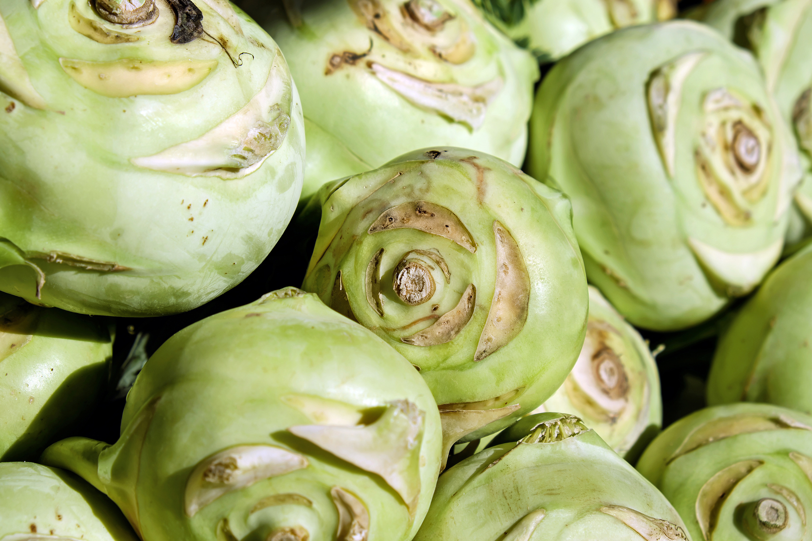

--- 
title: Voorbeeldrapport met INBOmd
subtitle: Dit is de standaardversie
author: 
  - name:
      given: Thierry
      family: Onkelinx
    email: thierry.onkelinx@inbo.be
    orcid: 0000-0001-8804-4216
    affiliation: Research Institute for Nature and Forest (INBO)
    corresponding: true
reviewer:
  - name:
      given: Floris
      family: Vanderhaeghe
    email: floris.vanderhaeghe@inbo.be
    affiliation: Research Institute for Nature and Forest (INBO)
    orcid: 0000-0002-6378-6229
github-repo: inbo/inbomd-examples
year: 2021
cover_photo: https://www.pexels.com/nl-nl/foto/hout-natuur-rood-creatief-4599227
cover_description: Detail van een blad. Foto door [Skyler Ewing](https://www.pexels.com/nl-nl/@skyler-ewing-266953?utm_content=attributionCopyText&utm_medium=referral&utm_source=pexels) via [Pexels](https://www.pexels.com/nl-nl/foto/hout-natuur-rood-creatief-4599227/?utm_content=attributionCopyText&utm_medium=referral&utm_source=pexels)
cover: media/cover.pdf # link naar pdf met cover
doi: 10.5281/zenodo.842223
reportnr: 99999
depotnr: D/2021/999999/999999
ordernr: Het optionele nummer van de opdrachtgever
funder: Research Institute for Nature and Forest (INBO) 
rightsholder: Research Institute for Nature and Forest (INBO)
community: inbo
keywords: corporate identity; example
publication_type: report
embargo: 2099-03-01
print:
  copies: 10
  motivation: Vereist door opdrachtgever
  pages: 123
client:
  - INBO Brussel
  - VAC Brussel ‐ Herman Teirlinck
  - Havenlaan 88 bus 73
  - 1000 Brussel
  - https://www.vlaanderen.be/inbo
client_logo: media/logo.jpg
cooperation:
  - INBO Brussel
  - VAC Brussel ‐ Herman Teirlinck
  - Havenlaan 88 bus 73
  - 1000 Brussel
  - https://www.vlaanderen.be/inbo
cooperation_logo: media/logo.jpg
style: INBO
lang: nl
lot: TRUE
lof: TRUE

site: bookdown::bookdown_site
link-citations: TRUE
bibliography: inbomd.bib

output:
  INBOmd::gitbook: default
  INBOmd::pdf_report: default
  bookdown::word_document2: default
  bookdown::dont_run: default
---

```{r setup, include = FALSE}
library(knitr)
opts_chunk$set(
  echo = TRUE, eval = TRUE, cache = FALSE, dpi = 300, fig.width = 150 / 25.4,
  fig.height = 100 / 25.4, warning = TRUE, error = TRUE, message = TRUE
)
library(ggplot2)
library(INBOtheme)
if (interactive()) {
  theme_set(
    theme_inbo(base_family = "FlandersArtSans-Regular", base_size = 10)
  )
} else {
  switch(
    opts_knit$get("rmarkdown.pandoc.to"),
    html = {
      opts_chunk$set(dev = "png", dpi = 72)
      theme_set(
        theme_inbo(base_family = "FlandersArtSans-Regular", base_size = 12)
      )
    },
    latex = {
      opts_chunk$set(dev = "cairo_pdf", dpi = 300)
      theme_set(
        theme_inbo(base_family = "FlandersArtSans-Regular", base_size = 9)
      )
      update_geom_defaults("point", list(size = 1.5))
    },
    epub3 = {
      opts_chunk$set(dev = "png", dpi = 300)
      theme_set(
        theme_inbo(base_family = "FlandersArtSans-Regular", base_size = 12)
      )
    }
  )
}
library(lipsum)
library(DT)
set.seed(201901017)
```

# Dankwoord {-}

`r paragraph(n = 5)`

<!--chapter:end:index.Rmd-->

# Voorwoord {-}

`r paragraph(n = 5)`

# Samenvatting {-}

<!-- description: start -->
Een uittreksel over ecologie uit [Wikipedia](https://nl.wikipedia.org/wiki/Ecologie)

Ecologie (ook wel met de spelling: _oecologie_) als wetenschap is een onderdeel van biologie. 
De ecologie bestudeert de dynamiek van de wisselwerking tussen organismen, populaties of levensgemeenschappen (de biotische milieufactoren) en de relaties tussen organismen, populaties, levensgemeenschappen of landschappen en het niet-biologische milieu (de abiotische milieufactoren). 
De studie op het niveau van de soort heet ook wel autoecologie en op het niveau van de levensgemeenschap en ecosysteem heet gemeenschapsecologie of synecologie.

Het woord ecologie (oorspronkelijk Duits:
_Ökologie_) <!-- spell-check: ignore -->
werd geïntroduceerd door de Duitse bioloog Ernst Haeckel in 1866, als samentrekking van de Griekse woorden 
_oikos_ <!-- spell-check: ignore -->
(huishouding) en
_logos_ <!-- spell-check: ignore -->
(studie, wetenschap).

In de Angelsaksische wereld werd dit
_ecology_, <!-- spell-check: ignore -->
dat daar een iets andere, meer milieukundige en mens-gerichte, betekenis kreeg. 
In Nederland bestaan het meer biologische oecologie en meer milieukundige ecologie naast elkaar, maar het verschil vervaagt.

Het woord ecologie wordt ook gebruikt in andere betekenissen:

- gerelateerd aan een beter milieu, in het bijzonder dat van de mens, 
- meer praktisch, betreffende gedrag dat goed is voor de mens en zijn milieu en voor de natuur (zie [ecologische landbouw](https://nl.wikipedia.org/wiki/Ecologische_landbouw) en [EKO-keurmerk](https://nl.wikipedia.org/wiki/EKO-keurmerk)), 
- gericht op een bepaalde levensbeschouwing (zie [ecologisme](https://nl.wikipedia.org/wiki/Ecologisme)).
- betreffende omgeving of netwerk van bijvoorbeeld een bedrijf.
<!-- description: end -->

# Aanbevelingen voor beheer en/of beleid {-}

`r paragraph(n = 5)`

<!--chapter:end:0a_samenvatting.Rmd-->

# English abstract {-}

\benglish

Excerpt on ecology taken from [Wikipedia](https://en.wikipedia.org/wiki/Ecology)

**Ecology** (from
oicos, <!-- spell-check: ignore -->
"house", or "environment";
logia, <!-- spell-check: ignore -->
"study of") is the branch of [biology](http://www.dictionary.com/browse/ecology|title=the definition of ecology|website=Dictionary.com|access-date=2018-02-20) which studies the interactions among organisms and their environment. 
Objects of study include interactions of organisms with each other and with abiotic components of their environment. 
Topics of interest include the biodiversity, distribution, biomass, and populations of organisms, as well as cooperation and competition within and between species.
Ecosystems are dynamically interacting systems of organisms, the communities they make up, and the non-living components of their environment. 
Ecosystem processes, such as primary production, pedogenesis, nutrient cycling, and niche construction, regulate the flux of energy and matter through an environment.
These processes are sustained by organisms with specific life history traits.
Biodiversity means the varieties of species, genes, and ecosystems, enhances certain ecosystem services.

Ecology is not synonymous with environmentalism, natural history, or environmental science.
It overlaps with the closely related sciences of evolutionary biology, genetics, and ethology.
An important focus for ecologists is to improve the understanding of how biodiversity affects ecological function. 
Ecologists seek to explain:

* Life processes, interactions, and adaptations
* The movement of materials and energy through living communities
* The successional development of ecosystems
* The abundance and distribution of organisms and biodiversity in the context of the environment.

Ecology has practical applications in conservation biology, wetland management, natural resource management (agroecology, agriculture, forestry, agroforestry, fisheries), city planning (urban ecology), community health, economics, basic and applied science, and human social interaction (human ecology). 
For example, the _Circles of Sustainability_ approach treats ecology as more than the environment 'out there'. 
It is not treated as separate from humans. Organisms (including humans) and resources compose ecosystems which, in turn, maintain biophysical feedback mechanisms that moderate processes  acting on living (biotic) and non-living (abiotic) components of the planet. 
Ecosystems sustain life-supporting functions and produce natural capital like  biomass production (food, fuel, fibre, and medicine), the regulation of climate, global biogeochemical cycles, water filtration, soil formation, erosion control, flood protection, and many other natural features of scientific, historical, economic, or intrinsic value.

The word "ecology"
("Ökologie") <!-- spell-check: ignore -->
was coined in 1866 by the German scientist Ernst Haeckel. 
Ecological thought is derivative of established currents in philosophy, particularly from ethics and politics [@LaferriereStoett1999]. 
Ancient Greek philosophers such as Hippocrates and Aristotle laid the foundations of ecology in their studies on natural history.
Modern ecology became a much more rigorous science in the late 19^th^ century.
Evolutionary concepts relating to adaptation and natural selection became the cornerstones of modern ecological theory.

\eenglish

<!--chapter:end:0b_abstract.Rmd-->

\bfrench

# Résumé français {- #resume-francais}

Extrait sur l'écologie de [Wikipedia](https://fr.wikipedia.org/wiki/%C3%89cologie)

L'**écologie**, également connue sous les noms de **bioécologie**, **bionomie** ou **science de l'environnement ou environnementale**, est la science qui étudie les êtres vivants dans leur milieu et les interactions entre eux.

Le terme écologie vient du grec
_oikos_ <!-- spell-check: ignore -->
(maison, habitat) et
_logos_ <!-- spell-check: ignore -->
(discours) : c'est la science de la maison, de l'habitat. 
Il fut inventé en 1866 par Ernst Haeckel, biologiste allemand pro-darwiniste. 
Dans son ouvrage Morphologie générale des organismes, il désignait par ce terme "la science des relations des organismes avec le monde environnant, c'est-à-dire, dans un sens large, la science des conditions d'existence".

Une définition généralement admise, particulièrement utilisée en écologie humaine, consiste à définir l'écologie comme étant le rapport triangulaire entre les individus d'une espèce, l'activité organisée de cette espèce et l'environnement de cette activité. 
L'environnement est à la fois le produit et la condition de cette activité, et donc de la survie de l'espèce.

Un **écologue** ou **écologiste** (qu'il soit chercheur, biologiste ou ingénieur écologue) est un spécialiste de l'écologie. Ce terme ne doit pas être confondu avec la dénomination écologiste comme adepte de l’écologisme ou comme partisan de l’écologie politique.

\efrench

<!--chapter:end:0c_resume.Rmd-->

\mainmatter

# Inleiding 

Het doel van dit document is louter de beschikbare stijlelementen te tonen. De pdf versie heeft als doelstelling een drukklare versie van een tweezijdig rapport af te leveren. De titelpagina's van het rapport en van de verschillende delen staan steeds op de rechterpagina. Het eerste hoofdstuk van een rapport of van een deel begint eveneens steeds op de rechterpagina. Hierdoor komt er een blanco pagina tussen een titelpagina en het eerste hoofdstuk. 

## Lipsum

Lorem ipsum is een opvultekst die drukkers, zetters, grafisch ontwerpers en dergelijke gebruiken om te kijken hoe een lay-out er uit ziet.

De reden waarom de tekst gebruikt wordt door die doelgroep is dat bij een leesbare tekst de lezer afgeleid zou worden door de inhoud, terwijl het alleen om de vormgeving gaat. Bovendien heeft het Lorem ipsum een redelijk normale afwisseling van de verschillende letters en korte en lange woorden.

In de broncode van dit document vind je stukjes code als `\usepackage{lipsum}` of `\lipsum[10]`. Deze code is enkel nodig om de stukjes van de Lipsum tekst te tonen. In een werkelijk rapport heb je deze uiteraard niet nodig.

<!--chapter:end:0d_frontmatter.Rmd-->

```{r generate_header, echo = FALSE}
header <- function(words = 4, format = FALSE) {
  requireNamespace("lipsum", quietly = TRUE)
  sprintf(
    ifelse(
      format,
      "%s '%s' `%s` _%s_ **%s**",
      "%s %s %s %s %s"
    ),
    lipsum::sentence(words = words), lipsum::sentence(words = words),
    lipsum::sentence(words = words), lipsum::sentence(words = words),
    lipsum::sentence(words = words)
  )
}
```

# Stijlen voor koppen: niveau 1: `r header(4)` {#koppen}

`r paragraph(n = 3)`

## Niveau 2: `r header(4)`

Automatische woordafbreking werkt niet bij niveau 2 naar pdf formaat. 
Zie sectie \@ref(s:onderlijnd).

`r paragraph(n = 3)`

### Niveau 3: `r header(4)`

`r paragraph(n = 3)`

#### Niveau 4: `r header(5)`

Automatische woordafbreking werkt niet bij niveau 4 naar pdf formaat. 
Zie sectie \@ref(s:onderlijnd).

`r paragraph(n = 3)`

##### Niveau 5: `r header(4)`

`r paragraph(n = 3)`

###### Niveau 6: `r header(4)`

`r paragraph(n = 3)`

# Stijlen voor koppen zonder nummer: niveau 1: `r header(4)` {- #koppen-zonder-nummer}

`r paragraph(n = 3)`

## Niveau 2: `r header(4)` {-}

`r paragraph(n = 3)`

### Niveau 3: `r header(4)` {-}

`r paragraph(n = 3)`

#### Niveau 4: `r header(5)` {-}

`r paragraph(n = 3)`

Ongenummerde koppen hebben maximaal niveau 4

# Lettertypes

In dit hoofdstuk tonen we de verschillende lettertypes en hun vormen. 
Deels om te tonen hoe ze er uitzien, deels om eventuele problemen op te sporen met bepaalde tekens.

## Normaal

ABCDEFHIJKLMNOPQRSTUVWXYZ abcdefghijklmonopqrstuvwxyz €$£ @&#§µ^ ()[]{}|²³<>/\\\_\*+- ,;:.?!~ äàáâã ëèéê ïìíî öòóô üùúû ÿ ç ñ ÄÀÁ ËÈÉÊ ÏÌÍÎ ÖÒÓÔ ÜÙÚÛ Ñ 0123456789  <!-- spell-check: ignore -->

`r paragraph(n = 1)`

Aanhalingstekens: "dubbele", 'enkele'

## Vet

**ABCDEFHIJKLMNOPQRSTUVWXYZ abcdefghijklmonopqrstuvwxyz €$£ @&#§µ^ ()[]{}|²³<>/\\\_\*+- ,;:.?!~ äàáâã ëèéê ïìíî öòóô üùúû ÿ ç ñ ÄÀÁ ËÈÉÊ ÏÌÍÎ ÖÒÓÔ ÜÙÚÛ Ñ 0123456789** <!-- spell-check: ignore -->

**`r paragraph(n = 1)`**

**Aanhalingstekens: "dubbele", 'enkele'**

## Cursief

_ABCDEFHIJKLMNOPQRSTUVWXYZ abcdefghijklmonopqrstuvwxyz €$£ @&#§µ^ ()[]{}|²³<>/\\\_\*+- ,;:.?!~ äàáâã ëèéê ïìíî öòóô üùúû ÿ ç ñ ÄÀÁ ËÈÉÊ ÏÌÍÎ ÖÒÓÔ ÜÙÚÛ Ñ 0123456789_ <!-- spell-check: ignore -->

_`r paragraph(n = 1)`_

_Aanhalingstekens: "dubbele", 'enkele'_

## Vet en cursief

**_ABCDEFHIJKLMNOPQRSTUVWXYZ abcdefghijklmonopqrstuvwxyz €$£ @&#§µ^ ()[]{}|²³<>/\\\_\*+- ,;:.?!~ äàáâã ëèéê ïìíî öòóô üùúû ÿ ç ñ ÄÀÁ ËÈÉÊ ÏÌÍÎ ÖÒÓÔ ÜÙÚÛ Ñ 0123456789_** <!-- spell-check: ignore -->
  
_**`r paragraph(n = 1)`**_

_**Aanhalingstekens: "dubbele", 'enkele'**_

## Met vaste tekenbreedte {#s:vaste-tekenbreedte}

`ABCDEFHIJKLMNOPQRSTUVWXYZ abcdefghijklmonopqrstuvwxyz €$£ @&#§µ^ ()[]{}|²³<>/\*+- ,;:.?!~ äàáâã ëèéê ïìíî öòóô üùúû ÿ ç ñ ÄÀÁ ËÈÉÊ ÏÌÍÎ ÖÒÓÔ ÜÙÚÛ Ñ 0123456789` <!-- spell-check: ignore -->

```{r echo = FALSE, results = "asis"}
cat("`", paragraph(), "`", sep = "")
```

`Aanhalingstekens: "dubbele", 'enkele'`

**`ABCDEFHIJKLMNOPQRSTUVWXYZ abcdefghijklmonopqrstuvwxyz €$£ @&#§µ^ ()[]{}|²³<>/\\\_\*+- ,;:.?!~ äàáâã ëèéê ïìíî öòóô üùúû ÿ ç ñ ÄÀÁ ËÈÉÊ ÏÌÍÎ ÖÒÓÔ ÜÙÚÛ Ñ 0123456789`** <!-- spell-check: ignore -->

```{r echo = FALSE, results = "asis"}
cat("**`", paragraph(), "`**", sep = "")
```

**`Aanhalingstekens: "dubbele", 'enkele'`**

80 karakters passen in de breedte van de pdf

`12345678911234567892123456789312345678941234567895123456789612345678971234567898`

**`12345678911234567892123456789312345678941234567895123456789612345678971234567898`**

100 karakters passen niet meer in de breedte van de pdf

`1234567891123456789212345678931234567894123456789512345678961234567897123456789812345678991234567890`

**`1234567891123456789212345678931234567894123456789512345678961234567897123456789812345678991234567890`**

## Onderscheiden van tekens

<!-- spell-check: ignore:start -->
|                                        | normaal | vet | cursief | vet en cursief | vaste tekenbreedte |
| -------------------------------------- | -- | -- | -- | -- | -- |
| Kleine letter L versus hoofdletter i   | lI | **lI** | _lI_ | **_lI_** | `lI` **`lI`** |
| Grote letter O versus cijfer 0         | O0 | **O0** | _O0_ | **_O0_** | `O0` **`O0`** |
 <!-- spell-check: ignore:end -->

# Opsommingen

## Ongeordende lijsten

- `r paragraph()`
- Item 2
- Item 3
    - Item a
        - item I
        - item II
            - item A
            - item B
            - `r paragraph()`
        - `r paragraph()`
    - `r paragraph()`
    - Item c
- Item 4

## Genummerde lijsten

1. `r paragraph()`
1. Item 2
1. Item 3
    1. Item a
        1. item I
        1. item II
            1. `r paragraph()`
            1. item B
            1. item C
        1. `r paragraph()`
    1. `r paragraph()`
    1. Item c
1. Item 4

## Lijsten met definities

Item A
  ~ `r paragraph()`
  
Langer item met titel B
  ~ `r paragraph()`
  
    Item B1 <!-- spell-check: ignore -->
      ~ `r paragraph()`

        Item B1a <!-- spell-check: ignore -->
          ~ `r paragraph()`

        Item B1b <!-- spell-check: ignore -->
          ~ `r paragraph()`

            Item B1b1 <!-- spell-check: ignore -->
              ~ `r paragraph()`
              
    Item B2 <!-- spell-check: ignore -->
      ~ `r paragraph()`

Item C
  ~ `r paragraph()`
  
Item D
  ~ `r paragraph()`

## Lijsten mengen

- Item 1
- Item 2
- Item 3
    1. Item a
    
        item I
          ~ Uitleg I
          
        item II
          ~ Uitleg II
          
    1. Item b
        - Item b I
        - Item b II
    1. Item c
        1. Item c I
        1. Item c II
- Item 4

# Kaders

De eenvoudigste manier om kaders in te voegen in RStudio is in de werkbalk het uitklapbaar menu
"Addins" <!-- spell-check: ignore -->
te kiezen. 
Vervolgens kies je in de lijst onder "INBOmd"
_insert "block"_ <!-- spell-check: ignore -->
(standaard kader),
_insert "exampleblock"_ <!-- spell-check: ignore -->
(kader met voorbeeld)
_insert "alertblock"_ <!-- spell-check: ignore -->
(kader met waarschuwing).

## Standaard kader

`r paragraph(n = 1)`

(ref:block) `r paragraph()`

```{block2, type = "block"}
Hier plaats je de tekst van het blok.
_Je kan geen **R** chunks of code uitvoeren in een blok._
Om de resultaten van een chunk in een blok te tonen moet je onderstaande truk
gebruiken.

(ref:block)

```

`r paragraph()`

(ref:block2a) `r paragraph()`

(ref:block2b) `r paragraph()`


```{block2, type = "block", latex.options = "{Optionele titel van het kader, enkel zichtbaar in pdf}"}
(ref:block2a)

(ref:block2b)

```

(ref:block3) `r paragraph()`

(ref:block3b) `r paragraph()`

```{block2, type = "block"}
(ref:block3)

(ref:block3b)

```

## Kader met voorbeeld
  
`r paragraph(n = 2)`

(ref:exampleblock) `r paragraph()`

```{block2, type = "exampleblock"}
Hier plaats je de tekst van het blok.
_Je kan geen **R** chunks of code uitvoeren in een blok._
Om de resultaten van een chunk in een blok te tonen moet je onderstaande truk
gebruiken.

(ref:exampleblock)

```

`r paragraph(n = 2)`

(ref:exampleblock2a) `r paragraph()`

(ref:exampleblock2b) `r paragraph()`

```{block2, type = "exampleblock", latex.options = "{Optionele titel van het kader, enkel zichtbaar in pdf}"}
(ref:exampleblock2a)

(ref:exampleblock2b)

```

(ref:exampleblock3) `r paragraph()`

(ref:exampleblock3b) `r paragraph()`

```{block2, type = "exampleblock"}
(ref:exampleblock3)

(ref:exampleblock3b)

```

## Kader met waarschuwing
  
`r paragraph(n = 2)`

(ref:alterblock) `r paragraph()`

```{block2, type = "alertblock"}
Hier plaats je de tekst van het blok.
_Je kan geen **R** chunks of code uitvoeren in een blok._
Om de resultaten van een chunk in een blok te tonen moet je onderstaande truk
gebruiken.

(ref:alterblock)

```

`r paragraph(n = 1)`

(ref:alterblock2a) `r paragraph()`

(ref:alterblock2b) `r paragraph()`

```{block2, type = "alertblock", latex.options = "{Optionele titel van het kader, enkel zichtbaar in pdf}"}
(ref:alterblock2a)

(ref:alterblock2b)

```

(ref:alterblock3) `r paragraph()`

(ref:alterblock3b) `r paragraph()`

```{block2, type = "alertblock"}
(ref:alterblock3)

(ref:alterblock3b)

```

<!--chapter:end:1_typografie.Rmd-->

# Kruisverwijzingen {#h:kruisverwijzing}

## Interne kruisverwijzingen

Kruisverwijzingen zijn eenvoudig te maken door te verwijzen naar de bijhorende label, bijvoorbeeld figuur \@ref(fig:koolrabi).
Doordat we verwijzen naar een uniek label, kan de software voor ons automatisch het juiste nummer berekenen.
De cijfers zijn een klikbare link.
Je kan kruisverwijzingen maken naar:

- koppen (\@ref(h:kruisverwijzing), \@ref(s:figuur-invoegen))
- tabellen (\@ref(tab:mtcars))
- figuren (\@ref(fig:koolrabi))
- formules (\@ref(eq:som)^[Het nummer van een formule krijgt automatisch haakjes.
Zie ook §\@ref(s:formule-nummer)])

Je voegt een label aan een kop toe door op het einde `{#mijn-label}` te plaatsen.
Hierbij vervang je `mijn-label` door iets zinvol en eenvoudig te onthouden.
Het is handig om steeds een prefix te gebruiken.
Bijvoorbeeld `h:` voor een hoofdstuk, `s:` voor een sectie.
Belangrijk om weten is dat elk label uniek moet zijn binnen het volledige document.
Gebruik enkel letters, cijfers, `:`, `/` en `-`.
Andere tekens als spaties of lage streepjes (`_`) zijn niet toegestaan.

## Externe verwijzingen

Naakte URLs moeten met het gebruikte protocol beginnen, bijvoorbeeld https://www.inbo.be.
Relevante protocols zijn `http://` en `https://` voor websites, `ftp://` voor ftp sites, `mailto:` voor email bijvoorbeeld `mailto:nobody@inbo.be`.

We kunnen de URL tevens achter een link tekst plaatsen bv [Google](https://google.be).
We kunnen deze techniek eveneens gebruiken voor de andere protocols, bijvoorbeeld [e-mail](mailto:nobody@inbo.be).

## Extra formattering

Voetnoten^[`r paragraph()`] zijn eenvoudig toe te voegen^[`r sentence()`].
Je voegt `^[gewenste voetnoot tekst]` in op de plaats waar een voetnoot dient te verschijnen.

Terugkerende voetnoten kun je een label geven en éénmalig in de broncode definiëren.[^yogi] Je kunt ze dan verschillende keren[^yogi] gebruiken.
Let wel: er wordt telkens een nieuwe voetnoot met een nieuw nummer aangemaakt.

[^yogi]: `r sentence()`

Tekst in onderschrift krijgt je door een `~` te plaatsen voor en achter de tekst die in onderschrift moet komen.
Bijvoorbeeld: `H~2~SO~4~` wordt H~2~SO~4~.
Bovenschrift krijg je op een gelijkaardige manier door `^` te gebruiken.
Bijvoorbeeld `Fe^2+^` wordt Fe^2+^. <!-- spell-check: ignore -->
Als alternatief kan je ook wiskundige formules^[Zie hoofdstuk \@ref(h:formules)] gebruiken.
Bijvoorbeeld: `$H_2SO_4$` wordt $H_2SO_4$ en `$Fe^{2+}$` wordt $Fe^{2+}$.
Je kan ook dingen doen als `$^3_2He$` ($^3_2He$) terwijl `^3^~2~He` (^3^~2~He) niet het gewenste resultaat geeft.

# Figuren en tabellen

## Tabellen

Tabellen zijn het eenvoudigst te genereren vanuit een `R data.frame` met de functie `kable()`.
De naam van de `chunk` met prefix `tab:` kan je vervolgens gebruiken als label om naar de figuur te verwijzen.
Bijschriften plaats je in `caption`.

```{r mtcars, echo = FALSE}
kable(
  head(mtcars[, 1:5], 10), booktabs = TRUE,
  caption = "Een tabel met de eerste 10 rijen van de `mtcars` dataset."
)
```

Je kan de tabellen eveneens dynamisch weergeven met behulp van de `datatable()` functie uit het `DT` package.
De HTML versie van het rapport zal dan een interactieve versie van de tabel bevatten.
Hier kan de gebruiker eenvoudig zoeken, sorteren, ...
Die functionaliteit is uiteraard niet beschikbaar in pdf formaat.
Daarom wordt in de pdf automatisch een schermafdruk gemaakt (figuur \@ref(fig:mtcars2)).

```{r mtcars2, echo = FALSE, fig.cap = "Dynamische tabel. Deze wordt automatisch vervangen door een schermafdruk bij formaten die geen dynamische inhoud kunnen weergeven.", out.width="\\textwidth"}
datatable(
  mtcars[, 1:5],
caption = "Een dynamische tabel met de eerste 10 rijen van de `mtcars` dataset."
)
```


## Figuren {#s:figuur-invoegen}

Figuren zijn het eenvoudigst toe te voegen als een R `chunk`.
De naam van de `chunk` met prefix `fig:` kan je vervolgens gebruiken als label om naar de figuur te verwijzen.
Bijschriften plaats je in `fig.cap`.

De afmetingen in een figuur zijn in principe gebaseerd op de afmetingen zoals gedefinieerd in het bestand: het aantal pixels gedeeld door de resolutie.

- 600 pixels breed / 600 dpi = 1 inch (25,4 mm)
- 600 pixels breed / 300 dpi = 2 inch (50,8 mm)
- 600 pixels breed / 72 dpi = 8.33 inch (211.7 mm)

Figuur \@ref(fig:koolrabi) is 4896 pixels breed en 3264 pixels hoog.
Standaard gebruikt de huisstijl een resolutie van 300 dpi.
De figuur in de pdf wordt dan 41.5 cm breed en 27.6 cm hoog, hetgeen uiteraard niet op A4 past.
In de HTML versie wordt een te grootte figuur automatisch verkleint tot de breedte van de tekst.
Er zijn truukjes om de figuur in pdf automatisch te verkleinen, doch dan werkt de HTML output niet meer zo goed.
De beste manier is de figuur zelf te verkleinen tot het gewenste formaat.
Een bijkomend voordeel is dat de bestandsgrootte enorm verkleind.
Figuur \@ref(fig:koolrabi2) geeft dezelfde foto die vooraf met externe software geschaald werd naar 1181 x 787 pixels.
Dat komt overeen met 10 cm breed bij een resolutie van 300 dpi.
De bestandsgrootte daalde met een factor van 2.9 MB naar 295 kB.
Hierdoor wordt het finale rapport veel compacter, zowel in pdf als HTML formaat.

```{r koolrabi, fig.cap = "Koolrabi, originele afmetingen", echo = FALSE}

```

```{r koolrabi2, fig.cap = "Koolrabi, verkleind", echo = FALSE}
include_graphics("media/kohlrabi-2266665-klein.jpg")
```

## Plaatsing van tabellen en figuren

Belangrijk om weten is dat, in het geval van het pdf formaat, de software zelf een zo goed mogelijke plaats zoekt voor de zwevende tabellen en figuren.
Dat kan uiteraard soms de mist in gaan.
Vooral wanneer er weinig tekst is in verhouding tot de figuren.
In die gevallen kan het zijn dat de figuren pas in een volgende `subsubsection` (kop 4), `subsection` (kop 3) of zelfs `section` (kop 2) getoond worden.
De figuren en tabellen zullen nooit in een volgend hoofdstuk terecht komen.
Wanneer je eerst een zwevende tabel invoegt (bijvoorbeeld tabel \@ref(tab:kable)) en iets later een lokale tabel (bijvoorbeeld tabel \@ref(tab:kable-longtable)), dan kan het gebeuren dat de zwevende tabel pas na de lokale tabel getoond wordt.
Het volgnummer hangt echter af van de plaatsing in de code, niet de finale plaats in het document.

De beste optie om hier iets aan te doen, is te zorgen voor voldoende tekst ;-).
Als het probleem zich enkel lokaal voordoet kan je op die plaats volgende code opnemen.

```
\FloatBarrier
```

Op dat moment worden eerst alle hangende figuren en tabellen geplaatst vooraleer verder te gaan met de tekst.
Door in de YAML: `floatbarrier: section` op te nemen wordt automatisch een `\FloatBarrier` geplaatst voor elke `section` (kop 2).
Je kan dit ook doen met `subsection` (kop 3) en `subsubsection` (kop 4).
Daarnaast kan je nog steeds ad hoc `\FloatBarrier` toevoegen.
`\FloatBarrier` heeft enkel invloed op de pdf versie van het rapport.

# Wiskundige formules {#h:formules}

## Formules tussen de tekst

Deze formules worden opgenomen binnen de tekst van de alinea.
Bijvoorbeeld $P(y < Y|\theta) = \alpha$.
Dit werkt het best met beknopte formules.
Formules die een zekere hoogte nodig hebben zullen in de mate van het mogelijke aangepast worden om zo min mogelijk hoogte in te nemen.
Een voorbeeld hier van is $\bar{X} = \sum_{i = 1}^NX_i$.
Hierbij zijn $i = 1$ en $N$ naast $\sum$ geplaatst in plaats van er boven.
Dat lukt uiteraard niet altijd.
Breuken zijn daar een goed voorbeeld van: $\frac{X}{Y}$.
In dat geval wordt het lettertype verkleind.
Hetgeen de leesbaarheid niet bevordert.
Bij complexe formule als $\frac{\sum_{i = 1}^NX_i}{\frac{\sum_{j = 1}^NY_j}{N}}$ is het noodzakelijk om tevens de regelafstand te vergroten.
In dergelijke gevallen is het beter om losstaande formules te gebruiken.

## Losstaande formules

Losstaande formules worden elk in een afzonderlijke alinea opgenomen.

$$P(y < Y|\theta) = \alpha$$

$$\bar{X} = \sum_{i = 1}^NX_i$$

$$\frac{X}{Y}$$

$$\frac{\sum_{i = 1}^NX_i}{\frac{\sum_{j = 1}^NY_i}{N}}$$

## Genummerde formules {#s:formule-nummer}

Het is tevens mogelijk om de losstaande formules te nummeren.
Het nummer bevat steeds het hoofdstuknummer als prefix.
Wanneer je aan dergelijke formule een label toekent, kan je er naar verwijzen.
Bijvoorbeeld: formule \@ref(eq:som).
Merk op dat het nummer dat naar een formule verwijst steeds tussen haakjes geplaatst wordt.
Het is praktisch om de prefix `eq:` te gebruiken in de labels van formules.

\begin{equation}
  \bar{X} = \sum_{i = 1}^NX_i
  (\#eq:som)
\end{equation}

\begin{equation}
  \frac{X}{Y}
\end{equation}

\begin{equation}
  \frac{\sum_{i = 1}^NX_i}{\frac{\sum_{j = 1}^NY_j}{N}}
\end{equation}

# Citeren van literatuur

## Vereisten

Bibliografische verwijzingen zijn geen probleem.
De bibliografie moet in CSL YAML, CSL JSON of BibTex formaat beschikbaar zijn.
De CSL formaten genieten de voorkeur omdat ze geen interne omzetting nodig hebben.
CSL YAML is leesbaarder dan CSL JSON.
Je kan je referentie naar deze formaten exporteren vanuit Zotero of Mendeley.

## Stijlen van verwijzingen in de tekst

- @BlauwdrukVleermuizen
- [@BlauwdrukVleermuizen]
- [zie @BlauwdrukVleermuizen, hoofdstuk 1]
- [@BlauwdrukVleermuizen; @Onkelinx2014a]

boeken
  ~ [@Agresti2002; @DiggleRibeiro2007; @ZuurEtal2009; @Bolker2008; @Kish_1965; @BanerjeeEtal2003; @franklin_mapping_2009; @book-a1e0]

deel van een boek
  ~ [@Degraer2013a; @BlauwdrukVogels; @BlauwdrukVleermuizen]

in proceedings <!-- spell-check: ignore -->
  ~ [@Onkelinx2014a; @Onkelinx2012]
  
artikels
  ~ [@Amano2012; @VanderMijnsbrugge2005; @R-reshape; @Yli-Viikari2007]

masterthesis
  ~ [@MaStatThesis]

software
  ~ [@R-3.0.1]

<!--chapter:end:2_andere_elementen.Rmd-->

# Code

```{r datasets, error = TRUE, message = TRUE}
# logical
c(TRUE, FALSE)
# integer
0:1
# numeric
c(0.0, 1.1)
# scientific
c(1e-10, 1e10)
# character
c("maandag", "dinsdag", "woensdag")
# factor
factor(c("maandag", "dinsdag", "woensdag"))
# function
my_fun <- function(x) {
  cat("mijn functie is", x)
}
# data.frame
state <- data.frame(
  region = state.region,
  Division = state.division,
  state.x77
)
# function
my_fun("cool")
# boodschappen
message("dit is een boodschap")
warning("dit is een waarschuwing")
stop("dit is een foutmelding")
# programma flow
if (is.data.frame(state)) {
  summary(state)
} else {
  stop("state is not a data.frame")
}
for (i in 1:5) {
  cat("i =", i, "\n")
}
```

## Door R berekende waarden gebruiken in gewone tekst

```{r echo = FALSE}
life_exp <- sprintf(
  "%.1f (%.1f; %.1f) jaren",
  mean(state$Life.Exp),
  quantile(state$Life.Exp, 0.025),
  quantile(state$Life.Exp, 0.975)
)
```

R output mengen met gewoon tekst is vrij eenvoudig.
Bijvoorbeeld $1 + 1 = `r 1+1`$.
Zorg er voor dat je in de tekst een enkel en eenvoudig R commando hoeft gebruiken.
Heb je een complexere berekening nodig dan doe je die op voorhand.
Bijvoorbeeld: de levensverwachting in de Verenigde Staten is `r life_exp`.

# Figuren

## Figuren in de tekst

In de tekst figuren worden steeds geplaatst waar de bijhorende code staat.
Ze kunnen bijgevolg ook in een alinea geplaatst worden.
Merk op dat figuren in de tekst om die reden geen bijschrift kunnen hebben.
Je kan er evenmin naar verwijzen.

```{r gg-mtcars, warning = FALSE}
ggplot(
  mtcars,
  aes(x = wt, y = mpg, colour = factor(cyl), fill = factor(cyl))
) +
  geom_point() +
  geom_smooth(method = "lm")
```

## Zwevende figuren

Zwevende figuren worden in de buurt van de code geplaatst.
Ze worden in de mate van het mogelijke op de plaats van de code geplaatst, bovenaan de pagina of onderaan de pagina.
Indien veel figuren onmiddellijk na elkaar geplaatst worden, zullen sommige figuren naar een volgende pagina verplaatst worden.
Je kan er naar verwijzen op basis van de naam van de `chunk`: figuur \@ref(fig:movie), \@ref(fig:diamond) en \@ref(fig:gg-mtcars1).

De standaardafmeting van figuren is 4.5 inch (114 mm) breed en 2.9 inch (74 mm) hoog.
Het bestandsformaat van de figuren hangt af van het outputformaat.
In geval van `pdf` worden `pdf` figuren aangemaakt, in geval van HTML `png` figuren (300 dpi).
Indien gewenst kan je hier van afwijken.
Dat kan zowel door een nieuwe standaard op te geven voor het volledige bestand als door aangepaste afmetingen op te geven voor individuele figuren.
Deze afmetingen moet je in inch opgeven.
Je kan ook forceren om een ander bestandsformaat te gebruiken.
Bijvoorbeeld `png` in plaats van `pdf`.
Dan kan nuttig zijn wanneer de figuur uit veel elementen bestaat, bijvoorbeeld een scatterplot van een grote dataset.

```{r movie, fig.cap= "Verdeling aandeel slokdarmkanker in Ille-et-Villaine, Frankrijk i.f.v. de leeftijdsgroep.", message = FALSE}
ggplot(esoph, aes(x = ncases / (ncases + ncontrols))) +
  geom_histogram() +
  facet_wrap(~agegp, scales = "free")
```

```{r diamond, fig.cap= "Histrogram van de diamantprijs i.f.v. kwaliteit van het slijpwerk.", message = FALSE, fig.width = 6, fig.height = 4}
ggplot(diamonds, aes(x = price, fill = cut)) +
  geom_histogram()
```

```{r gg-mtcars1, fig.cap= "Verbruik van wagens uit 1974 in miles per gallon in functie van hun gewicht in 1000 pond, opgesplitst volgens aantal cylinders.", dev = "png"}
ggplot(
  mtcars,
  aes(x = wt, y = mpg, colour = factor(cyl), fill = factor(cyl))
) +
  geom_point() +
  geom_smooth(method = "lm")
```

# Tabellen

Er zijn een aantal mogelijke manieren om een `data.frame` in tabelvorm weer te geven.

```{r genereer-tabel}
# functies om tabellen te genereren
cijfer_tabel <- function(rijen = 20, kolommen = 10) {
  data.frame(
    matrix(
      rnorm(rijen * kolommen),
      nrow = rijen,
      ncol = kolommen
    ),
    row.names = paste("rij", seq_len(rijen))
  )
}
random_woord <- function(n_letters = 5) {
  paste(
    sample(letters, size = n_letters, replace = TRUE),
    collapse = ""
  )
}
random_zin <- function(n_woorden = 10, n_letters = 10) {
  paste(
    sapply(rpois(n_woorden, n_letters), FUN = random_woord), collapse = " "
  )
}
tekst_tabel <- function(
    rijen = 20, kolommen = 10, n_woorden = 10, n_letters = 5
) {
  x <- data.frame(
    matrix(
      sapply(
        rpois(rijen * kolommen, lambda = n_woorden), random_zin, n_letters
      ),
      nrow = rijen,
      ncol = kolommen
    )
  )
  colnames(x) <- head(LETTERS, kolommen)
  return(x)
}
genereer_tabel <- function(
    rijen = 20, kolommen = c(5, 5), n_woorden = 10, n_letters = 5
) {
  cbind(
    cijfer_tabel(rijen = rijen, kolommen = kolommen[1]),
    tekst_tabel(
      rijen = rijen, kolommen = kolommen[2], n_woorden = n_woorden,
      n_letters = n_letters
    )
  )
}
```

## `kable()`

We raden aan om in eerste instantie `kable()` te gebruiken.
De standaard (tabel \@ref(tab:kable)) genereert zowel tabellen in pdf als HTML output formaat.
In pdf formaat wordt het een zwevende tabel.
Dat houdt in dat de volledige tabel op een pagina geplaatst wordt van zodra er plaats is om de volledige tabel te plaatsen.
Is de tabel zo groot dat ze niet op een pagina past, dan valt het laatste stuk van de pagina.

```{r kable}
kable(
  genereer_tabel(50, c(4, 2), 4, 4), caption = "Standaard output van `kable()`."
)
```

Het markdown formaat is handig voor grotere tabellen met tekst.
Wanneer de tekst te lang is, worden de rijen over meerdere regels gespreid. Indien nodig wordt de tabel over meerdere pagina's gespreid.
Het nadeel is dat je geen bijschrift kan plaatsen en er ook niet naar kan verwijzen.

```{r kable-markdown}
kable(genereer_tabel(20, c(4, 3), 5, 4), digits = 2, format = "markdown")
```

De laatste optie is het pandoc formaat (tabel \@ref(tab:kable-pandoc)).
Dit gedraagt zich als het `longtable` formaat met een aangepaste lay-out.

```{r kable-pandoc}
kable(
  genereer_tabel(50, c(3, 1), 4, 4), digits = 3, format = "pandoc",
  caption = "pandoc output van `kable()`"
)
```

## Mogelijke alternatieven

### Aangepaste `kable()` formaten voor pdf output

De `booktabs` optie past een lay-out met minder lijnen toe (tabel \@ref(tab:kable-booktabs)).
Nu geven we ook het gewenste aantal decimalen voor elke kolom weer.
Nu past de tabel omdat we een aangepast aantal rijen en kolommen hebben gekozen.

```{block2 kable-warning, type="alertblock"}
De argumenten hebben geen invloed over het uitzicht in de HTML versie.

```

```{r kable-booktabs}
kable(
  genereer_tabel(40, c(4, 1), 5, 4), digits = 1:5, booktabs = TRUE,
  caption = "Booktabs output van `kable()`"
)
```

Het `longtable` formaat is geschikt wanneer we een tabel hebben die langer is dan een pagina (tabel \@ref(tab:kable-longtable)).
Dit soort tabel is geen zwevende tabel.
Dat wil zeggen dat ze onmiddellijk start daar waar de code ze genereert.
Onderaan de pagina wordt de tabel afgebroken en op de volgende pagina opnieuw gestart.
Merk op dat een te brede tabel nog steeds wordt afgebroken.

```{r kable-longtable}
kable(
  genereer_tabel(40, c(4, 1), 4, 4), digits = 2, longtable = TRUE,
  caption = "Longtable output van `kable()`."
)
```

### Het `kableExtra` package

`kableExtra` biedt de mogelijkheid om het uitzicht van `kable()` tabellen aan te passen.
Je kan in een zelfde commando zowel het HTML als pdf formaat aanpassen.
In plaats van hier een beperkt aantal voorbeelden te geven, verwijzen we liever naar de uitgebreide vignettes van `kableExtra`.
Ze hebben een vignette voor [HTML output](https://cran.r-project.org/web/packages/kableExtra/vignettes/awesome_table_in_html.html) en [pdf output](https://cran.r-project.org/web/packages/kableExtra/vignettes/awesome_table_in_pdf.pdf).

### `pandoc.table()`

`pandoc.table()` komt uit het `pander` package.

Voordelen:

1. Zet tabellen steeds naar markdown formaat. Dit betekent dat je steeds een brede waaier aan outputformaten kan gebruiken.

Nadelen:

1. Je moet steeds `results='asis'` toevoegen aan de `chunk` opties.

### `xtable()`

`xtable()` komt uit het `xtable` package. 

Voordelen:

1. Biedt veel mogelijkheden om tabellen fijn af te stellen.
  Zie `?xtable` en `?print.xtable` voor alle details.
  Een paar handige opties:
    - tabellen liggend weergeven
    - namen van rijen of kolom roteren
    - het lettertype van de tabel verkleinen (of vergroten)
1. Biedt native code voor latex (pdf) en HTML.

Nadelen:

1. Je moet steeds `results='asis'` toevoegen aan de `chunk` opties.
1. Kan niet dynamisch kiezen tussen pdf of HTML. Minder handig als je zowel HTML als pdf output wilt.
1. Kruisverwijzingen zijn lastig, zeker als je ze zowel in pdf als HTML wilt hebben.

<!--chapter:end:3_r_code.Rmd-->

# Lay-out tips voor pdf

Bij de omzetting van Markdown naar pdf wordt gebruik gemaakt van [LaTeX](https://nl.wikipedia.org/wiki/LaTeX), software speciaal gemaakt voor het zetten van wetenschappelijke documenten. 
Meestal werk dit zeer goed. 
Soms gaat het de mist in. 
Vooral in situatie wanneer het aandeel tekst klein is in vergelijking met andere elementen zoals figuren en tabellen. 
Dit kan een indicatie zijn dat je te weinig tekst of te veel figuren hebt ;-)

## Nieuwe pagina forceren

Door `\pagebreak` te plaatsen forceer je de start van een nieuwe pagina op deze plaats. 
Gebruik dit enkel wanneer je altijd een nieuwe pagina wilt starten en niet om tekst samen te houden.

## Tekst samenhouden

Standaard mag een nieuwe pagina starten voor een kop maar niet na een kop. 
Op die manier wordt een kop samengehouden met de eerst volgende paragraaf. 
Stel dat je een kop 2, een kop 3 en dan gewone tekst hebt. 
De kop 3 en de eerste regels van de gewone tekst worden samengehouden. 
Tussen kop 2 en kop 3 heb je twee conflicterende regels. 
Enerzijds laat kop 2 geen nieuwe pagina toe na zichzelf, terwijl kop 3 een nieuw pagina toelaat voor zichzelf. 
Uiteindelijk wint het toelaten van de nieuwe pagina omdat de pagina's dan optimaler gevuld worden. 
Met als gevolg dat kop 2 onderaan de pagina staat en kop 3 bovenaan de nieuwe pagina.

Als dergelijk situatie zich voordoet kan je het `\needspace` commando gebruiken.
Dit commando meet hoeveel plaats er nog overblijft onderaan de pagina, gemeten op het punt waar je het commando plaatst. 
Deze verticale ruimte wordt vergeleken met de waarde die je opgeeft in het commando. 
Is die ruimte te klein, dan wordt een nieuwe pagina gestart. Hieronder vind je een concreet voorbeeld.

```markdown
Een paragraaf

\needspace{50mm}

## Een kop 2

### Een kop 3

De eerste paragraaf onder kop 3
```

\needspace{50mm} <!-- spell-check: ignore -->

## Problemen met zwevende figuren en tabellen

### Foutmelding: `too many unprocessed floats`

Je document bevat een hoofdstuk met heel veel zwevende figuren of tabellen die nog niet gezet worden. 
Dit treedt meestal op wanneer je meer dan 20 zwevende objecten hebt in een hoofdstuk. 
De truck is een `\FloatBarrier` plaatsen. 
Dit forceert dat eerst alle nog zwevende objecten gezet worden voor dat de rest van de tekst gezet wordt. 

### Zwevende figuur of tabel wordt in de volgende sectie geplaatst

LaTeX gaat zelf op zoek naar de optimale plaats om een zwevende figuur (of tabel) te plaatsen. 
Ideaal is dat vlakbij het punt waar je de figuur in de tekst geplaatst hebt. 
Wanneer je voldoende tekst hebt is dat meestal geen probleem. 
Is je figuur nogal groot of plaats je verschillende figuren vlak bij elkaar, dan gaat LaTeX opzoek naar een geschikte plaats verder in het document. 
Hierdoor kan het gebeuren dat de figuur in een volgende (sub)sectie terecht komt. 
Als je een `\FloatBarrier` toevoegt voor de nieuwe sectie begint, dan dwing je LaTeX om eerst alle nog zwevende elementen te plaatsen voor dat de volgende sectie gezet wordt.

### Automatische `\FloatBarrier`

Alle zwevende elementen bij INBOmd blijven steeds binnen het hoofdstuk waarin ze gedefinieerd zijn. 
Je kan dit strenger instellen door in de `yaml` de optie `floatbarrier: section` toe te voegen. 
Dit is equivalent met het manueel plaatsen van een  `\FloatBarrier` voor elke kop van niveau 2 of hoger (`#` en `##`). 
Andere opties zijn `floatbarrier: subsection` en `floatbarrier: subsubsection` die staan voor respectievelijk kop 3 (`#`, `##` en `###`) en kop 4 (`#`, `##`, `###` en `####`).

## Woordafbreking

In de html en epub versie is woordafbreking niet van toepassing.
De woordafbreking van pdf documenten gebeurd automatisch en in functie van de taal^[Bijgevolg lukt de automatische woordafbreking niet bij een willekeurige tekenreeks. Denk hierbij aan de link naar een bestand op Google Drive zoals https://docs.google.com/presentation/d/10KkXEv4r3wWtdKvB6RFOPe809eMNldODaRqQxn-jeME/edit#slide=id.g321e330f74_1_997. Overweeg in dergelijke gevallen om het bestand via Zenodo te publiceren, wat een korte link oplevert https://doi.org/10.5281/zenodo.842223. Een andere mogelijkheid is de link achter een [woord](https://docs.google.com/presentation/d/10KkXEv4r3wWtdKvB6RFOPe809eMNldODaRqQxn-jeME/edit#slide=id.g321e330f74_1_997) te plaatsen].
Kies daarom de stijl `Flanders` als de hoofdtaal van de document anders dan Nederlands is.
Als je binnen een document een langer stuk in een ander taal dan de hoofdtaal hebt (bijv. Engelse samenvatting in een Nederlandstalig rapport), moet je aangeven dat dat stuk in de betrokken taal is.
Je doet dit voor aan het begin `\b_taal_` en aan het einde `\e_taal_` te gebruiken waarbij je `_taal_` vervangt door de Engelse naam van de taal.
Dus `\benglish` en `\eenglish` voor Engels, `\bdutch` en `\edutch` voor Nederlands en `\bfrench` en `\efrench` voor Frans.

We lijnen de paragrafen zowel links als rechts uit.
Om de tekst rechts uit te lijnen zal LaTeX de spaties breder of smaller maken.
Om te vermijden dat de spaties te groot of te klein worden, kunnen we een woord afbreken.
Als we het woord niet kunnen afbreken, is een alternatief om het woord toch op de dezelfde regel te houden en bijgevolg een langere regel te krijgen.
LaTeX zal in dat laatste geval een afweging maken tussen te brede of te smalle spaties of een te lange regel.
Regels met weinig spaties en een woord op het einde met weinig mogelijkheden qua woordafbreking maken het moeilijk om alle mooi rechts uit te lijnen zonder heel brede of heel smalle spaties te gebruiken.
In dergelijke gevallen zal LaTeX ervoor kiezen om de regel langer te maken.

Soms breekt LaTeX een woord niet af, of op de verkeerde plaats.
Om dat te verhelpen kan je in de YAML onder de tag `hyphenation` een kommagescheiden lijst van woorden opnemen met de gewenste plaatsen waar de LaTeX het woord mag afbreken.
Bijvoorbeeld `hyphenation: bio-lo-gische, waar-derings-kaart, wild-detectie-systeem` zal wilddetectiesysteem enkel afbreken als
wild-detectiesysteem  <!-- spell-check: ignore -->
of wilddetectie-systeem.

```{block2, type = "alertblock"}
Wanneer je een koppelteken in een woord gebruikt, dan zal LaTeX dat woord _enkel op dat punt_ afbreken.
Woorden met vaste tekenbreedte (§\@ref(s:vaste-tekenbreedte)) zal LaTeX _nooit_ afbreken.

**voorbeeld met koppelteken**  
abcdefg abcdefg abcdefg abcdefg abcdefg abcdefg abcdefg abcdefg abcdefg abcdefg multi-disciplinair.  
abcdefg abcdefg abcdefg abcdefg abcdefg abcdefg abcdefg abcdefg abcdefg abcdefg a multi-disciplinair.  
abcdefg abcdefg abcdefg abcdefg abcdefg abcdefg abcdefg abcdefg abcdefg abcdefg ab multi-disciplinair.  
abcdefg abcdefg abcdefg abcdefg abcdefg abcdefg abcdefg abcdefg abcdefg abcdefg abc multi-disciplinair.  
abcdefg abcdefg abcdefg abcdefg abcdefg abcdefg abcdefg abcdefg abcdefg abcdefg abcd multi-disciplinair.  
abcdefg abcdefg abcdefg abcdefg abcdefg abcdefg abcdefg abcdefg abcdefg abcdefg abcde multi-disciplinair.  
abcdefg abcdefg abcdefg abcdefg abcdefg abcdefg abcdefg abcdefg abcdefg abcdefg abcdef multi-disciplinair.  
abcdefg abcdefg abcdefg abcdefg abcdefg abcdefg abcdefg abcdefg abcdefg abcdefg abcdefg multi-disciplinair.  
abcdefg abcdefg abcdefg abcdefg abcdefg abcdefg abcdefg abcdefg abcdefg abcdefg abcdefg a multi-disciplinair.  
abcdefg abcdefg abcdefg abcdefg abcdefg abcdefg abcdefg abcdefg abcdefg abcdefg abcdefg ab multi-disciplinair.  
abcdefg abcdefg abcdefg abcdefg abcdefg abcdefg abcdefg abcdefg abcdefg abcdefg abcdefg abc multi-disciplinair.  

**voorbeeld zonder koppelteken**  
abcdefg abcdefg abcdefg abcdefg abcdefg abcdefg abcdefg abcdefg abcdefg abcdefg multidisciplinair.  
abcdefg abcdefg abcdefg abcdefg abcdefg abcdefg abcdefg abcdefg abcdefg abcdefg a multidisciplinair.  
abcdefg abcdefg abcdefg abcdefg abcdefg abcdefg abcdefg abcdefg abcdefg abcdefg ab multidisciplinair.  
abcdefg abcdefg abcdefg abcdefg abcdefg abcdefg abcdefg abcdefg abcdefg abcdefg abc multidisciplinair.  
abcdefg abcdefg abcdefg abcdefg abcdefg abcdefg abcdefg abcdefg abcdefg abcdefg abcd multidisciplinair.  
abcdefg abcdefg abcdefg abcdefg abcdefg abcdefg abcdefg abcdefg abcdefg abcdefg abcde multidisciplinair.  
abcdefg abcdefg abcdefg abcdefg abcdefg abcdefg abcdefg abcdefg abcdefg abcdefg abcdef multidisciplinair.  
abcdefg abcdefg abcdefg abcdefg abcdefg abcdefg abcdefg abcdefg abcdefg abcdefg abcdefg multidisciplinair.  
abcdefg abcdefg abcdefg abcdefg abcdefg abcdefg abcdefg abcdefg abcdefg abcdefg abcdefg a multidisciplinair.  
abcdefg abcdefg abcdefg abcdefg abcdefg abcdefg abcdefg abcdefg abcdefg abcdefg abcdefg ab multidisciplinair.  
abcdefg abcdefg abcdefg abcdefg abcdefg abcdefg abcdefg abcdefg abcdefg abcdefg abcdefg abc multidisciplinair.  

**voorbeeld met vaste tekenbreedte**  
abcdefg abcdefg abcdefg abcdefg abcdefg abcdefg abcdefg abcdefg abcdefg `multidisciplinair.`  
abcdefg abcdefg abcdefg abcdefg abcdefg abcdefg abcdefg abcdefg abcdefg a `multidisciplinair.`  
abcdefg abcdefg abcdefg abcdefg abcdefg abcdefg abcdefg abcdefg abcdefg ab `multidisciplinair.`  
abcdefg abcdefg abcdefg abcdefg abcdefg abcdefg abcdefg abcdefg abcdefg abc `multidisciplinair.`  
abcdefg abcdefg abcdefg abcdefg abcdefg abcdefg abcdefg abcdefg abcdefg abcd `multidisciplinair.`  
abcdefg abcdefg abcdefg abcdefg abcdefg abcdefg abcdefg abcdefg abcdefg abcde `multidisciplinair.`  
abcdefg abcdefg abcdefg abcdefg abcdefg abcdefg abcdefg abcdefg abcdefg abcdef `multidisciplinair.`  
abcdefg abcdefg abcdefg abcdefg abcdefg abcdefg abcdefg abcdefg abcdefg abcdefg `multidisciplinair.`  
abcdefg abcdefg abcdefg abcdefg abcdefg abcdefg abcdefg abcdefg abcdefg abcdefg abcdefg `multidisciplinair.`  
abcdefg abcdefg abcdefg abcdefg abcdefg abcdefg abcdefg abcdefg abcdefg abcdefg abcdefg abcdefg `multidisciplinair.`
```

## Foutmelding bij het gebruik van `%` in bijschriften.

`%` wordt gebruikt als commentaarteken in LaTeX. 
In gewone tekst kan Markdown daar mee zonder problemen overweg, maar in bijschriften moet je een kleine omweg gebruiken. 
Je moet deze truck ook gebruiken als je Markdown formattering wilt gebruiken in bijschriften.

<!-- spell-check: ignore:start -->
````markdown 
Een gewone paragraaf.

(ref:mijn-label) Een 100% **cool** `bijschrift`

`r ''````{r mijn-label, fig.cap='(ref:mijn-label)'}
plot(cars)  # jouw grafiek
```
````
<!-- spell-check: ignore:end -->

## Gebruik van markdown syntax of quotes in onderlijnde koppen {#s:onderlijnd}

Het onderlijnen van koppen stuurt de regelafbreking in de war wanneer extra opmaak wordt gebruikt. 
De beste oplossing zou zijn om de koppen niet te onderlijnen. 
Onderlijnen wordt echter opgelegd in de generieke huisstijl van de Vlaamse overheid.

Je kan het probleem op drie manieren omzeilen:

1. Gebruik een titel die op 1 lijn past
1. Gebruik enkel standaard tekst. Dus geen opmaak of quotes.
In principe is cursieve tekst enkel toegestaan wanneer dat strikt noodzakelijk is.
Bijvoorbeeld bij wetenschappelijke namen.
1. Definieer regeleindes handmatig met het \\break commando. 
Deze oplossing werkt overigens enkel wanneer je geen vette tekst gebruikt.
Anderzijds hoort het al dan niet vet zijn bij de definitie van de huisstijl en hoor je dat als auteur niet te gebruiken in een kop.

## Disserendi artem nullam habuit. 'Etiam fringilla faucibus augue.' `Nullam laoreet fermentum urna.` _Fusce dignissim facilisis tortor._  <!-- spell-check: ignore -->

Voorbeeld van kop 2 met extra opmaak.

#### Disserendi artem nullam habuit. 'Etiam fringilla faucibus augue.' `Nullam laoreet fermentum urna.` _Fusce dignissim facilisis tortor._  <!-- spell-check: ignore -->

Voorbeeld van kop 4 met extra opmaak.

## Disserendi artem nullam habuit. 'Etiam fringilla \break faucibus augue.' `Nullam laoreet fermentum urna.` \break _Fusce dignissim facilisis tortor._  <!-- spell-check: ignore -->

Voorbeeld van kop 2 met extra opmaak en manuele plaatsing van regeleindes.

#### Disserendi artem nullam habuit. 'Etiam fringilla faucibus augue.' \break `Nullam laoreet fermentum urna.` _Fusce dignissim facilisis tortor._  <!-- spell-check: ignore -->

Voorbeeld van kop 4 met extra opmaak en manuele plaatsing van regeleindes.

## _Fusce dignissim facilisis tortor._ <!-- spell-check: ignore -->

Korte kop 2 in cursief.

#### _Fusce dignissim facilisis tortor._  <!-- spell-check: ignore -->

Korte kop 4 in cursief.

<!--chapter:end:4_tips.Rmd-->

```{r references, results = "asis", echo = FALSE}
# insert the references at this position
# set appendix = FALSE, when the report has no appendix
INBOmd::references(appendix = TRUE)
```

<!--chapter:end:y_referenties.Rmd-->

# Bijlage: referentietekst voor INBO medewerkers

`r paragraph(n = 5)`

# Bijlage: referentietekst voor INBO medewerkers

`r paragraph(n = 5)`

<!--chapter:end:z_bijlage.Rmd-->

